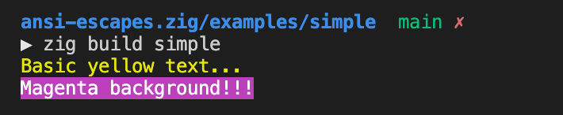
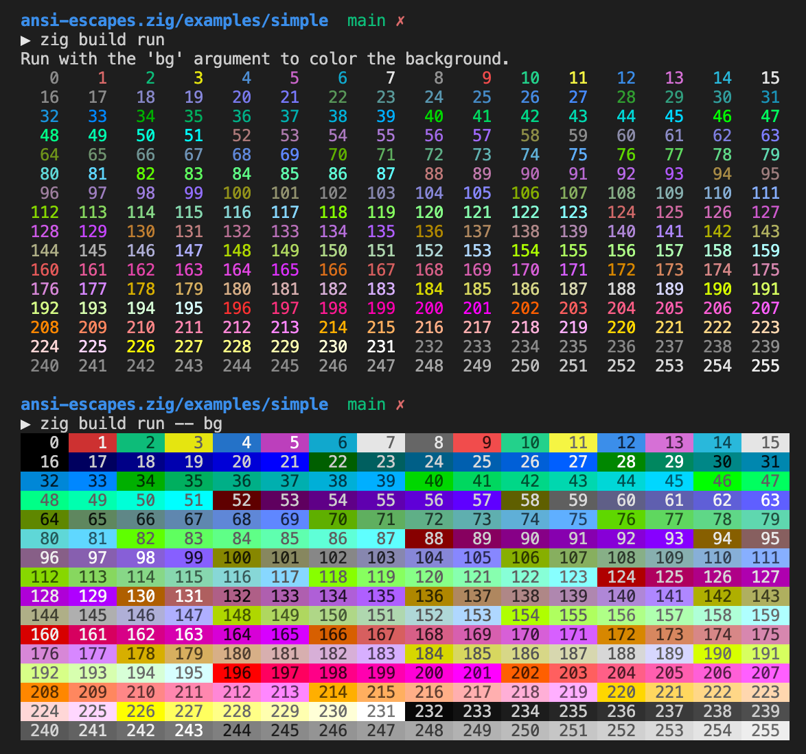

# ANSI Escape Codes for Zig

Simple library to make it easy to print output on terminals supporting ANSI escape codes.

This allows printing colorized text and background, and adding simple text styles like underlined and even blinking.

## Usage

### Importing into your project

Add the path to the ansi-escapes library to your `build.zig` file:

```zig
lib.addPackagePath("ansi-escapes", "lib/ansi-escapes.zig/ansi-escapes.zig");
```

Import `ansi-escapes` into your zig code:

```zig
const ansi = @import("ansi-escapes");
```

### Basic colors

To use one of the traditional, basic colors:

```zig
const std = @import("std");
const ansi = @import("ansi-escapes");
const stdout = std.io.getStdOut().writer();

const yellow = ansi.Color.yellow.apply;

pub fn main() !void {
    const alloc = std.testing.allocator;
    const buffer = "Basic yellow text...\n";

    const formatted = try yellow(alloc, buffer);
    defer alloc.free(formatted);
    
    try stdout.writeAll(formatted);
}
```

The `apply` methods applies the color to the foreground (the text itself).

To colorize the background, use `applyBg`:

```zig
const magenta_bg = ansi.Color.magenta.applyBg;

const buffer2 = "Magenta background!!!\n";
const formatted2 = try magenta_bg(alloc, buffer2);
defer alloc.free(formatted2);
try stdout.writeAll(formatted2);
```

> All color types have `apply` and `applyBg` methods.

Result of running both statements above (see [simple.zig](examples/simple.zig)):



List of basic colors:

```
black
red
green
yellow
blue
magenta
cyan
white
```

Colors starting with `b_` are _bright_ colors.

Example: `b_blue` is bright blue.

### Color8 (8-bit colors)

For a total of 256 different colors (with values from 0 to 255), use `Color8`:

```zig
const color = ansi.Color8{.value = 42};
const colorized = try color.apply(alloc, text);
```

Run the demo to display all `Color8` varieties on your terminal:

```bash
cd examples/ && zig build color8
```

The result should look like this:



### RGBColor (24-bit colors)

> Notice that not many terminals support 24-bit colors.

If you want even more colors, try `RGBColor`.

```zig
const color = ansi.RBGColor{.red = 42, .green = 43, .blue = 44};
const colorized = try color.applyBg(alloc, text);
```

### DisplayStyle

You can style text using `DisplayStyle`.

```zig
const bold = ansi.Displaystyle.bold;
const bold_text = try bold.apply(alloc, text);
```

List of styles:

```
bold
faint
italic
underline
blinking
fast_blinking
reverse
hidden
```

### The `style` function

The `style` function allows setting multiple styles and foreground/background color simultaneously.

Set fg (foreground color), bg (background color) and some styles:

```zig
const std = @import("std");
const ansi = @import("ansi-escapes.zig");
const stdout = std.io.getStdOut().writer();

pub fn main() !void {
    const alloc = std.testing.allocator;
    const buffer = "Style this!\n";

    const styled_text = try ansi.style(alloc, buffer[0..], .{
        .fg = .red,
        .bg = .white,
        .styles = &.{ .italic, .bold },
    });
    defer alloc.free(styled_text);

    try stdout.writeAll(styled_text);
}
```

## Demos

To run the demos, cd into `examples` and run `zig build <demo>`.

Demos:

- [cli](examples/cli.zig)
- [simple](examples/simple.zig)
- [color8](examples/color8.zig)
